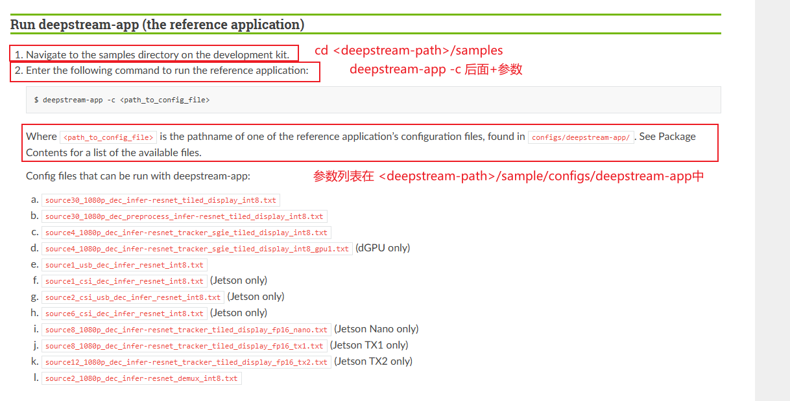
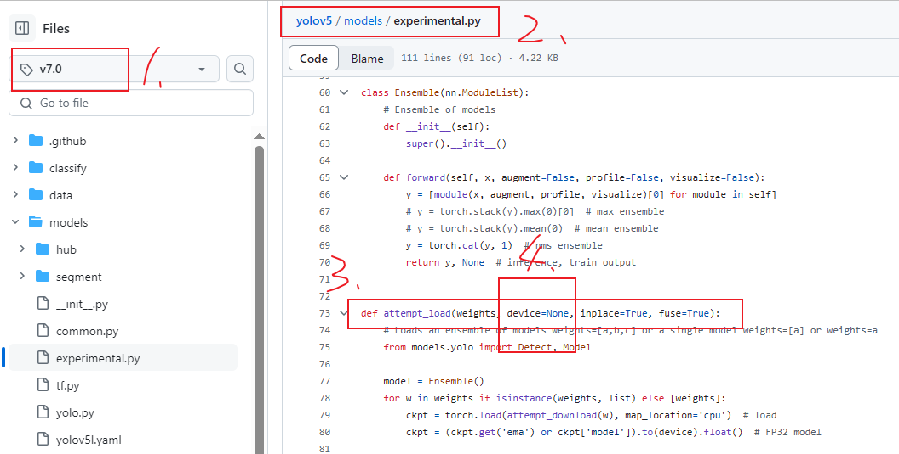
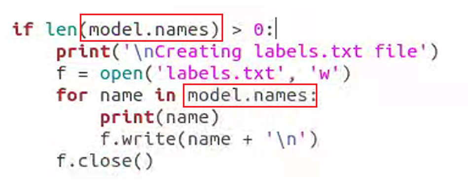

# jetpack4.6.1+deepstreamSDK6.0.1+yolov5-6.0+deepstream-yolo安装

## 前言+问题

全文结构如下


deepstream-yolo官方更新了所有的branches，只留了一个master（图中1所示），所以曾经的包都不再维护，现在的版本支持所有deepstreamSDK版本（图中2所示）


本文提倡忠于官方文档，所述如何找到官方README并跟随，并给出一些异常处理建议

注意：1、运行所有的git clone命令都要小心，因为下载的都是新版本，需要手动打开链接并找到历史版本

​            2、运行系统相关命令都要使用tab补全，不要手动输入，会犯错！


## 总览

deepstreamSDK6.0.1安装

yolov5-6.0安装

deepstream-yolo安装

## deepstreamSDK6.0.1安装

总思路：找到历史文件，此处官网会不间断更新，历史文件位置一定一样。

https://developer.nvidia.com/deepstream-sdk


下载完之后跟随教程，连接如下

https://docs.nvidia.com/metropolis/deepstream/6.0.1/dev-guide/text/DS_Quickstart.html


安装完成后测试安装：



```
例如：
$ deepstream-app -c samples/configs/deepstream-app/source6_csi_dec_infer_resnet_int8.txt 
```


success即为成功

## yolov5-6.0安装

https://github.com/ultralytics/yolov5

### 找到资源

找到所需branch，进入


### 找到对应教程


#### 前置依赖安装

根据教程，基本意思就是打开requirement，然后把torch和torchvision注释掉，因为版本需要匹配


#### torch+torchvision安装

随后安装torch和torchvision，官方已给出如何做版本匹配，点进去


找到自己需要的版本，如何查看jetpack版本自己百度


下载完之后，进入python环境安装

此处注意，安装包之前，先确定pip和pip3的软链接，python和python3的软链接，确保安装到对的地方。

```
cd /path/to/your_whl
pip3 install xxx.whl
```

#### 其他包安装

别的包安装很简单，缺啥补啥，直接运行python3 detect.py，报什么错就装什么，不要直接使用requirement一键安装

#### 测试

只要detect.py运行成功，yolo就算安装成功

#### 注意

```
此处yolo官方与deepstream-yolo官方产生了矛盾，接下来安装deepstream-yolo的时候以deepstream-yolo官方文档为准
```

## deepstream-yolo安装

https://github.com/marcoslucianops/DeepStream-Yolo

阅读github自述文件


官方给出的版本略不匹配，jetpack4.6.4为jetpack4.6的小更新版本，基本适用于jetpack4.6.1


### 下载

git clone或者下载tar然后放到盒子里都行，如果盒子能科学上网就git，不行都下tar

方法一：git


方法二：


```
将下载的目标“Deepstream-Yolo”文件夹放在<deepstream6.0-path>/source中
```


### 生成onnx

此处的变化跟之前很大，原来是使用pt-->wts+cfg，现在变为pt-->onnx


#### 找教程


doc里面yolov5.md


教程里是第一步下载yolov5，这一步我们已经完成，跳过

注意看pip下包，后续可能会用到，但是先不下，运行某个py的时候缺啥补啥


#### 跟教程

下面注意！！！！！！！！！，最大的坑来了


原来转脚本使用的是一个叫gen_wts.py的东西，取而代之，新文件叫export_yolov5.py，这个文件所属在“<deepstream-yolo-path>/utils中”。

跟着教程第二步，将这个文件复制到yolov5目录下；第三步下载pt，怎么下都行，建议提前下好放到盒子里

#### 运行export_yolov5.py，解决报错

跟着教程第四步，官方给出的运行脚本如下：

```
python3 export_yoloV5.py -w yolov5s.pt --dynamic
```

正常运行发生报错，百度里面90%都是说依据老版本，所以百度搜不到，只能自己看源码排错。本质原因是export_yolov5.py这个脚本支持的是最新版的yolov5-7.0

##### 报错1：attempt_load接收了意料之外的参数

因为yolo5-7.0版本更新了attempt_load方法，以前接收map_location，现在接收device，但是本质上是一个东西。下图是yolo5-7.0与yolo5-6.0对比。




所以修改export_yolov5.py中的报错行，将device改为map_location


##### 报错2：model.name  type：list，has no attribute key（）

报错原因具体来说是生成labels.py的时候，字典数据类型变成了list数据类型。


找到报错行，将key和value删掉，加上一行"print(name)" 测试是否正常。



##### 报错3：onnx version 17 don‘t support

报错原因是yolov5-7.0默认使用torch版本过高，onnx不支持


直接将default减小，从17到12都试一试，找到不报错的版本就行。

#### 模型生成成功，继续跟教程

教程第五步


此时onnx和lable.txt 正常产生，两个文件复制到deepstream-Yolo中

### 编译

此处有多种方式将cuda设置为env

第一种：export变量


第二种：更改编译文件，直接写死


随后编译，文档中步骤三的那行命令的意思是，make，nvdsinfer_custom_impl_Yolo，找到此目录中的Makefile文件，clean&make

```
make -C nvdsinfer_custom_impl_Yolo clean && make -C nvdsinfer_custom_impl_Yolo
```

所以执行这一步需要在nvdsinfer_custom_impl_Yolo目录的上级目录

成功后生成libnvdsinfer_custom_impl_Yolo.so文件

### 修改deepstream-yolo配置文件并运行

根据教程修改两个txt，随后运行


出现画面即为成功


